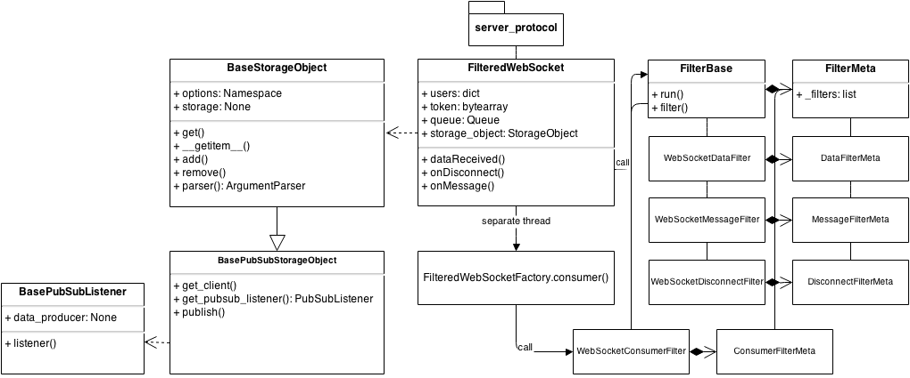

Filtered WebSocket
===================

Filtered WebSocket is a straight forward framework for implementing websocket servers which draws inspiration from UNIX process pipelines.  It's a metaphor for:

    cat server_event | behavior_a | behavior_b | ...

Server event handlers are encapsulated within filters such that building elaborate behaviors is as easy as importing new modules.  Imported filters automatically add themselves to an appropriate filter chain (pipeline).

Pipelines aside, writing server modules is extremely terse.  This module creates a 'chat' server:

    class ChatServer(WebSocketMessageFilter):
    @classmethod
    def filter(cls, web_socket_instance, data):
        for client_id, client in web_socket_instnace.users.items():
            client.sendMessage(bytes(data))

*features:*

- Supports SSL
- Scales horizontally via remote backend storage (redis) and pubsub
- Supports token based auth

    
###### Read The Docs
http://filtered-websocket.readthedocs.org/en/latest/

###### Quickstart

##### Install 
    pip install filtered_websocket

##### A Simple Broadcast Server
The server should always be started from the command line, with new behaviors specified via importing filter modules with the "-f" option.  By default the server will run on port 9000 with the broadcast_messages filter activated.
    
    #  start the server
    fws_server

    # start the server with the broadcast module explicitly
    fws_server -f filtered_websocket.filters.broadcast_messages

##### Redis Integration
Custom storage objects may be specified by setting the environment variable "STORAGE_OBJECT_MODULE" for instance, to store all user session data in a redis instance:

    export STORAGE_OBJECT_MODULE="filtered_websocket.storage_objects.redis"
    # Changing the storage object will add new options
    fws_server -h
    
    usage: server.py [-h] [-p PORT] [-c CONFIG] [-f [FILTERS [FILTERS ...]]]
                     [-key KEY] [-cert CERT] [--redis_host REDIS_HOST]
                     [--redis_port REDIS_PORT]
                     [--redis_channels [REDIS_CHANNELS [REDIS_CHANNELS ...]]]
                     [--redis_key REDIS_KEY]

##### Redis PubSub Integration

Storage objects that support pubsub, like redis, may be used for passing messages via filters.  To pass messages to all connected clients via a redis channel named "global" run:

    export STORAGE_OBJECT_MODULE="filtered_websocket.storage_objects.redis"
    fws_server -f filtered_websocket.filters.broadcast_pubsub --redis_channels global

###### Define a unique server via a json config file
    # config.json
    {
        "port": "9000",
        "filters": ["filtered_websocket.filters.broadcast_messages_by_token", "filtered_websocket.filters.stdout_messages"]
    }

    # Passing it in creates a broadcast by token server with backed by redis which prints all messages to stdout
    fws_server -c config.json

###### Create New Filters

Filter chains are implemented like so:

    >>> class AFilter(FilterMeta)
    >>>     pass
    >>>
    >>> @add_metaclass(AFilter)
    >>> class A(FilterBase):
    >>>         pass
    
    >>> Class B(A):
    >>>     @classmethod
    >>>     def filter(cls, web_socket_instance):
    >>>        print("foo")
    
    >>> Class C(A):
    >>>     @classmethod
    >>>     def filter(cls, web_socket_instance):
    >>>         print("bar")
    
    >>> A.run(web_socket_instance)
    foo
    bar

In filtered_websocket.server each server event has a corresponding base filter class, like the class 'A' shown above:

    WebSocketDataFilter # Will run against any data received event
    WebSocketMessageFilter # Will run against any valid message frames
    WebSocketDisconnectFilter # Will run anytime a client disconnects
    WebSocketConsumerFilter # Will run against any data placed into a web socket instance's queue

To create a new filter simply inherit from one of the base filter classes.

*example: stdout_rawdata.py*

    import sys
    from base import WebSocketDataFilter
    
    
    class BroadcastMessageFilter(WebSocketDataFilter):
        """
        Runs on each dataReceived event.
        """
        @classmethod
        def filter(cls, web_socket_instance, data):

###### Project Layout 

